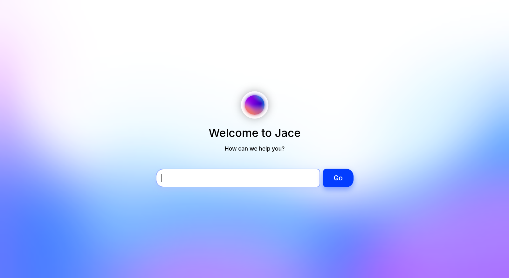
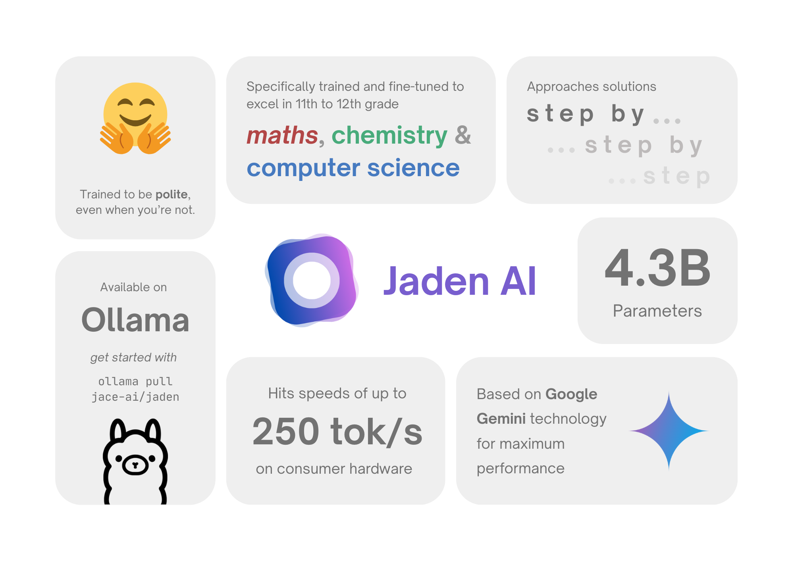
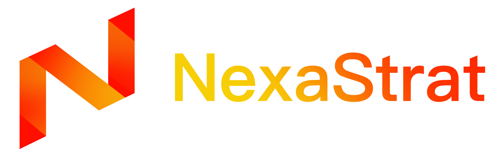
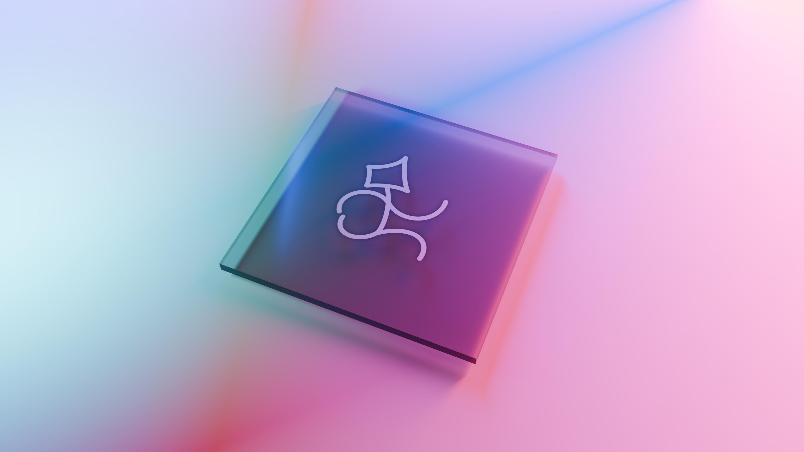
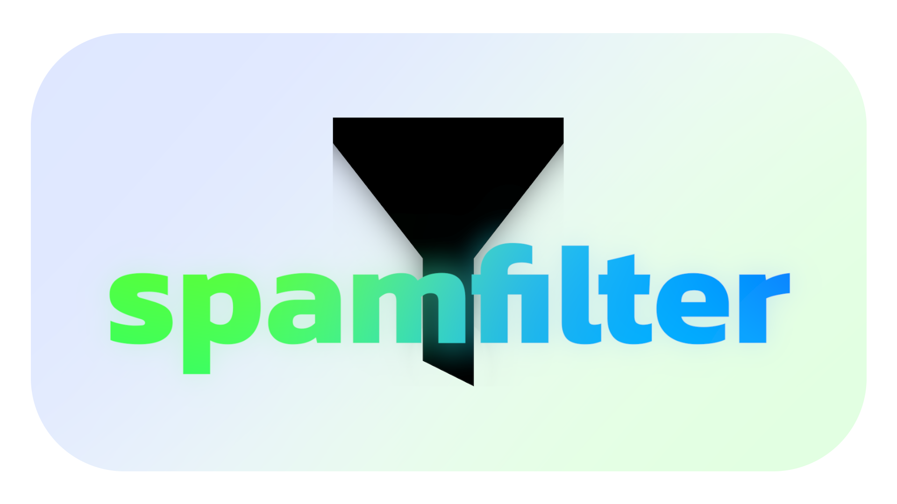
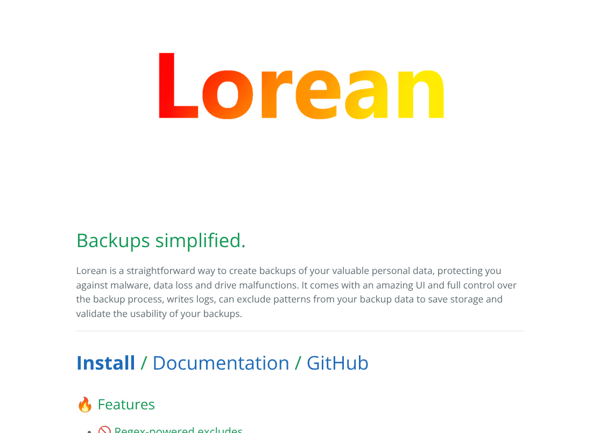

# Projects

I've worked on many different projects over the time, and some are really fun to play with.

> [!IMPORTANT]
>
> This page is a small collection of my favorite projects. These are mostly recent ones from 2024 and 2025, but I have many more projects that I worked on in the past. Some of them - not all though - tend to have awful coding quality and are not useful enough to be "re-mastered", so to say!

They're grouped into small categories for a better overview!

## Artifial Intelligence and Large Language Models

- [Jace](https://github.com/mags0ft/Jace) - A proof-of-concept for the council-of-models method, which allows you to mix several LLMs together and have them discuss over a problem.

  

- [Jaden](https://ollama.com/jace-ai/jaden) - Strong, student-tailored fine-tune based on Google Gemma technology to help you with studying.

  

- [hle-eval-ollama](https://github.com/mags0ft/hle-eval-ollama) - An easy-to-use evaluation tool for running Humanity's Last Exam on (locally) hosted Ollama instances.

  

- [Heavy participation](./Contributions.md) at [Alpaca](https://github.com/jeffser/Alpaca), an easy-to-use, adaptive Ollama client that works with any other OpenAI-compatible API.

  

- [NexaStrat](https://lichess.org/@/NexaStrat) - An average-playing chess AI to face intermediate players for training, fully written in Python using the `python-chess` library, scoring ~1520 Elo points.

  

## CPU design

- [JoltCore-16](https://github.com/mags0ft/JoltCore-16) - Fully self-designed 16-bit RISC CPU with custom ISA, 128 KiB of RAM & ROM, 8 I/O ports, self-written assembler and emulator; extended during a school project mentored by ARM co-creator Steve Furber.

  

## Competitions

- [BwInf-2025-R1-Solutions](https://github.com/mags0ft/BwInf-2025-R1-Solutions) - Participation in the "Bundeswettbewerb Informatik" (Federal Competition in Computer Science).
- [Informatikbieber](https://bwinf.de/biber/) - Participation in the "Informatik-Biber" (Computer Science Beaver) competition.
- [INVENT a CHIP 2025](https://www.invent-a-chip.de/invent-a-chip) - Hardware design competition, open-source repository with solutions will be published after the competition ends.

## Data & processing

- [spamfilter](https://github.com/mags0ft/spamfilter) - Streamlined, object-oriented and fully customizable python spam filter library. [Available on PyPI](https://pypi.org/project/spamfilter/) as `spamfilter`.

  

- [Lorean](https://github.com/mags0ft/Lorean) - Quick-to-use and organized app to manage, create and restore your backups. (_Old code - terrible! Written when I was 15 years old._)

  

